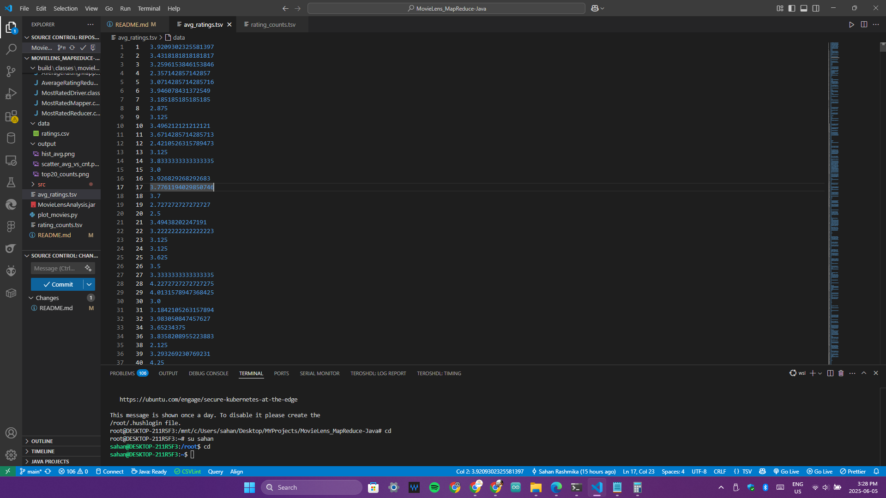
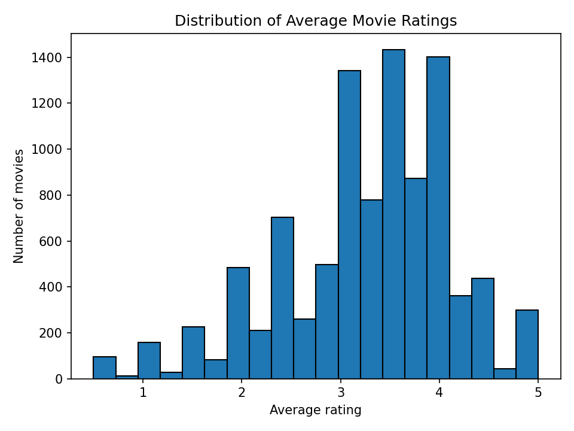
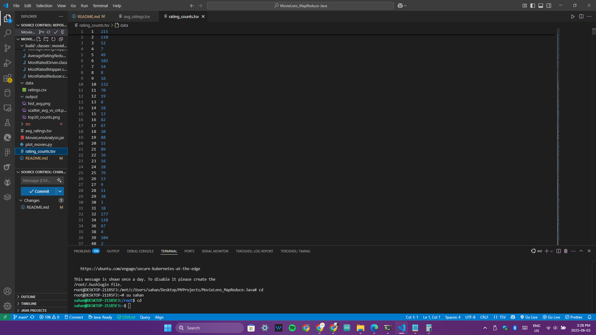
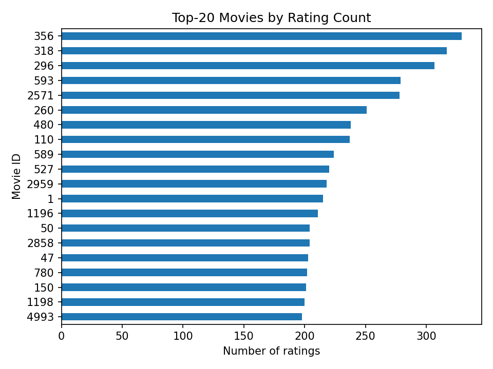

# Hadoop MapReduce Analysis of MovieLens 25M Ratings

## Project Structure
This project implements two MapReduce jobs using Hadoop to analyze the MovieLens 25M dataset. The first job calculates the average rating per movie, and the second job counts the number of ratings each movie received. The results are then visualized using Python.

## Project Directory Structure
The project is organized into directories for source code, data, and output, as follows:

```

.
├── README.md                  # Instructions to compile and run MapReduce jobs
├── src/
│   └── movielens/
│       ├── AverageRatingMapper.java        # Mapper: (movieId, rating)
│       ├── AverageRatingReducer.java       # Reducer: computes average rating
│       ├── MostRatedMapper.java            # Mapper: (movieId, 1) for counting
│       ├── MostRatedReducer.java           # Reducer: sums ratings count
│       ├── AverageRatingDriver.java        # Driver: runs avg rating job
│       └── MostRatedDriver.java            # Driver: runs most rated job
├── MovieLensAnalysis.jar       # Compiled jar (after build)
|── build/
|    └── classes/
|        └── [compiled .class files]
├── output/
│   └── [plotted images from plot_movies.py]
├── plot_movies.py               # Python script to plot results (matplotlib)
├── rating_counts.tsv           # Output: movieId and total count (most rated job)
└── avg_ratings.tsv             # Output: movieId and average rating (avg rating job)

```
## Overview of MapReduce Jobs

This project implements two MapReduce jobs to analyze the MovieLens 25M dataset:

1. **Average Rating Job**: This job calculates the average rating for each movie. It reads the `ratings.csv` file, where each line contains a user ID, movie ID, rating, and timestamp. The mapper emits `(movieId, rating)` pairs, and the reducer computes the average rating for each movie.
2. **Most Rated Job**: This job counts the number of ratings each movie received. The mapper emits `(movieId, 1)` for each rating, and the reducer sums these counts to produce a total count of ratings per movie.

## Dataset

The dataset used in this project is the **MovieLens 25M Ratings** dataset, which contains 25 million ratings from users on various movies. The dataset is available on Kaggle - https://www.kaggle.com/datasets/garymk/movielens-25m-dataset . 

The relevant file for this project is `ratings.csv`, which contains the following columns:

- `userId`: Unique identifier for each user.
- `movieId`: Unique identifier for each movie.
- `rating`: Rating given by the user (on a scale of 0.5 to 5.0).
- `timestamp`: Timestamp of when the rating was given (not used in this analysis).

## Prerequisites

To run this project, you need the following:
- **Hadoop**: A Hadoop environment set up (local or cluster).
- **Java**: Java Development Kit (JDK) installed to compile the Java code.
- **Python**: Python with `matplotlib` installed to visualize the results.

---

## Setup Instructions

### Install WSL and Ubuntu on Windows

**a. Install WSL:**
Open **PowerShell as Administrator** and run:

```powershell
wsl --install
```

* After installation, restart your computer if prompted.
* Launch Ubuntu from the Start menu.
* Set your **username** and **password**.

*(If Ubuntu is not installed, search for “Ubuntu” in Microsoft Store and install it.)*

**b. Update Ubuntu:**
In the Ubuntu terminal:

```bash
sudo apt update && sudo apt upgrade
```

---

### Set Up SSH (for Hadoop)

Hadoop uses SSH to manage nodes (even on a single node).
**Remove and reinstall OpenSSH:**

```bash
sudo apt --assume-yes remove openssh-server
sudo apt --assume-yes install openssh-server
```

**Generate an SSH key (no passphrase):**

```bash
ssh-keygen -t rsa
```

(Press Enter twice to leave the passphrase empty.)

**Add your SSH key to authorized keys:**

```bash
cat ~/.ssh/id_rsa.pub >> ~/.ssh/authorized_keys
chmod 600 ~/.ssh/authorized_keys
```

**Start SSH service:**

```bash
sudo service ssh start
```

**Test SSH connection:**

```bash
ssh localhost
```

---

### Install Java (Required for Hadoop)

```bash
sudo apt install openjdk-11-jdk
```

---

### Download and Extract Hadoop

**Download and extract Hadoop 3.4.1:**

```bash
wget -c https://downloads.apache.org/hadoop/common/hadoop-3.4.1/hadoop-3.4.1.tar.gz
tar -xvzf hadoop-3.4.1.tar.gz
mv hadoop-3.4.1 ~/hadoop-3.4.1
```

---

### Configure Hadoop

* Move to the Hadoop directory:

  ```bash
  cd ~/hadoop-3.4.1
  ```
* Edit configuration files: `core-site.xml`, `hdfs-site.xml`, `mapred-site.xml`, `yarn-site.xml` inside `~/hadoop-3.4.1/etc/hadoop/`.
  *(You can use `nano`, `vim`, or `code` from VS Code if installed:)*

  ```bash
  nano etc/hadoop/core-site.xml
  ```

  *(Paste the necessary config at the end of each file. See the official [Hadoop Single Node Setup](https://hadoop.apache.org/docs/current/hadoop-project-dist/hadoop-common/SingleCluster.html) for details.)*

---

### Set Hadoop Environment Variables

Edit your `.bashrc` file:

```bash
nano ~/.bashrc
```

Add these lines at the end (edit paths/versions as needed):

```bash
export JAVA_HOME=/usr/lib/jvm/java-11-openjdk-amd64
export HADOOP_HOME=~/hadoop-3.4.1
export PATH=$PATH:$HADOOP_HOME/bin
export HADOOP_CONF_DIR=$HADOOP_HOME/etc/
export HADOOP_CLASSPATH=$JAVA_HOME/lib/tools.jar
```

Reload:

```bash
source ~/.bashrc
```

---

### Format HDFS and Start Hadoop

**Format HDFS:**

```bash
cd ~/hadoop-3.4.1
bin/hdfs namenode -format
```

**Start Hadoop:**

```bash
sbin/start-dfs.sh
sbin/start-yarn.sh
```


## How to Run the MapReduce Jobs

- Follow these instructions to run the Hadoop MapReduce analysis.

1. **Setup Hadoop Environment:** Ensure that Hadoop is installed and configured on your system (HADOOP\_HOME set, etc.). You can run these jobs on a local standalone mode, a pseudo-distributed (single-node) cluster, or a full cluster. Make sure HDFS and YARN are running if using pseudo/full distribution.

2. **Obtain the Dataset:** Download the **MovieLens 25M Ratings** dataset (the `ratings.csv` file) from Kaggle or GroupLens. Place `ratings.csv` in a local directory (or directly in HDFS). If running in HDFS, you may need to create a directory and put the file there. For example:

   * Create an HDFS directory for input (if not already):

     ```bash
     hadoop fs -mkdir -p /user/yourusername/movielens
     ```
   * Upload the `ratings.csv` file to HDFS:

     ```bash
     hadoop fs -put /path/to/ratings.csv /user/yourusername/movielens/ratings.csv
     ```

   *(Replace `/path/to/ratings.csv` with the actual path where you saved the dataset.)*

3. **Compile the Code:** Navigate to the project source directory and compile the Java code into a jar. You can use Hadoop’s built-in compiler invocation for convenience. For example, from the project root directory:

   ```bash
   # Compile all Java files in src/ (assuming current dir has src/movielens/*.java)
   $HADOOP_HOME/bin/hadoop com.sun.tools.javac.Main -d classes src/movielens/*.java
   # Package the compiled classes into a jar file
   jar -cvf MovieLensAnalysis.jar -C classes/ .
   ```

   This will create `MovieLensAnalysis.jar` containing all the classes. (Ensure that `$HADOOP_HOME/bin` is in your PATH or adjust the path accordingly.) The above uses Hadoop's built-in `javac` tool and classpath to compile the code, then creates a jar file.

4. **Run the Average Rating job:** Use the `hadoop jar` command to run the first MapReduce job that calculates average rating per movie. For example:

   ```bash
   hadoop jar MovieLensAnalysis.jar movielens.AverageRatingDriver \
       /user/yourusername/movielens/ratings.csv /user/yourusername/movielens/output/avg_ratings
   ```

   In this command, the first argument is the HDFS input path to the ratings.csv, and the second is the HDFS output path for the job results. Make sure the output directory (`.../output/avg_ratings`) does **not** exist before running (Hadoop will refuse to run if the output path already exists). The job will read the input, distribute the work among mappers and reducers, and produce output in the specified output folder.

   * You should see Hadoop progress logs in the console. For example, it will show map and reduce progress (0% to 100%) and then a message indicating the job completed successfully. *Ensure the job finishes with a "completed successfully" message.* The console output might include lines like:

     ```
     INFO mapreduce.Job:  Job job_local... completed successfully
     ```

     (This confirms the MapReduce job ran to completion.)

5. **Run the Most Rated Count job:** Next, run the second job to count ratings per movie:

   ```bash
   hadoop jar MovieLensAnalysis.jar movielens.MostRatedDriver \
       /user/yourusername/movielens/ratings.csv /user/yourusername/movielens/output/rating_counts
   ```

   This will create an output directory `/user/yourusername/movielens/output/rating_counts` with the count of ratings for each movie. Again, monitor the console for successful completion.

6. **Verify Output:** After each job, you can verify the results in HDFS. Hadoop will produce one or more part files in the output directories. You can use `hadoop fs` (or `hdfs dfs`) commands to inspect them. For example, to check the first few lines of the average ratings result:

   ```bash
   hadoop fs -head /user/yourusername/movielens/output/avg_ratings/part-r-00000
   ```

   This should show lines in the format `movieId <average_rating>`. Similarly, for the rating counts:

   ```bash
   hadoop fs -head /user/yourusername/movielens/output/rating_counts/part-r-00000
   ```

   which will show `movieId <total_count>` lines. (You might also download the part files to local system for easier viewing using `hadoop fs -get`.)

   *Sample output (for illustration)*:

   ```
   1    4.0  
   2    3.5  
   3    4.2  
   ... 
   ```

   Each line represents a movieId and its computed average or count.

## Plot Results (Python Visualization)
After running the MapReduce jobs, you can visualize the results using Python. The `plot_movies.py` script reads the output files and generates plots.
stall requirements (if needed): `pip install matplotlib pandas`

Run:

```bash
python plot_movielens.py
```
Output images will be saved in the output/ folder.

## Access Hadoop Web UIs
Get your WSL IP:
```
    hostname -I
```
You can also use `localhost` if running on a single-node setup.

Then, open your web browser and access the Hadoop UIs:
```bash
# Open in your Windows browser:
      HDFS UI (NameNode): http://<WSL-IP>:9870 or http://localhost:9870
      YARN UI (ResourceManager): http://<WSL-IP>:8088 or http://localhost:8088
   ```
Open in your Windows browser:

## Shutdown Hadoop and WSL
After you finish your analysis, it’s a good practice to stop Hadoop services and WSL:  
```bash
# Stop Hadoop services
cd ~/hadoop-3.4.1
sbin/stop-dfs.sh
sbin/stop-yarn.sh
# Stop WSL
wsl --shutdown
```
## Summary of Steps
1: Install WSL and Ubuntu on Windows
   - Use PowerShell to install WSL.
   - Launch Ubuntu and set up your username/password.

2️: Set up SSH for Hadoop
   - Install OpenSSH server.
   - Generate SSH keys and configure authorized keys.
   - Start the SSH service and test connection.

3️: Install Java
   - Install OpenJDK 11 using `apt`.

4️: Download and extract Hadoop
   - Download Hadoop 3.4.1 and extract it to your home directory.

5️: Configure Hadoop
   - Edit `core-site.xml`, `hdfs-site.xml`, `mapred-site.xml`, and `yarn-site.xml` in the Hadoop configuration directory.
   - Set environment variables in `.bashrc` for Hadoop and Java.

6️: Format HDFS and start Hadoop
   - Format HDFS using `bin/hdfs namenode -format`.
   - Start Hadoop services with `sbin/start-dfs.sh` and `sbin/start-yarn.sh`.

7️: Compile the MapReduce jobs
   - Compile Java code in the `src/movielens` directory and create a jar file.

8️: Run the Average Rating job and Most Rated job
   - Use `hadoop jar` command to run the Average Rating job on the `ratings.csv` file. 
   - Use `hadoop jar` command to run the Most Rated job on the same `ratings.csv` file.

9: Verify output files
   - Use `hadoop fs -head` to check the output files for average ratings and rating counts.

10: Visualize results with Python
   - Run `plot_movies.py` to generate plots from the output files.

1️1: Access Hadoop Web UIs
   - Open HDFS and YARN UIs in your web browser using the WSL IP or `localhost`.

1️2: Shutdown Hadoop and WSL
   - Stop Hadoop services and shut down WSL.

---

## Interpreting the Results

* **rating_counts.tsv**: Shows which movies are most rated (popularity).
* **avg_ratings.tsv**: Shows which movies have highest/lowest average ratings (quality).

---

## Screenshots of Output

   ### Avg Ratings

   - Contains movieId and average rating (from the Average Rating job)
   

   - Sample plots generated by `plot_movies.py`
   

   ### Most Rated

   - Contains movieId and total count of ratings (from the Most Rated job)
   

   - Sample bar chart of most rated movies by `plot_movies.py`
   

---

## References

* [kaggle - MovieLens 25M Dataset](https://www.kaggle.com/datasets/garymk/movielens-25m-dataset)
* [GroupLens MovieLens Datasets](https://grouplens.org/datasets/movielens/)
* [Hadoop MapReduce Tutorial](https://hadoop.apache.org/docs/stable/hadoop-mapreduce-client/hadoop-mapreduce-client-core/MapReduceTutorial.html)

---


